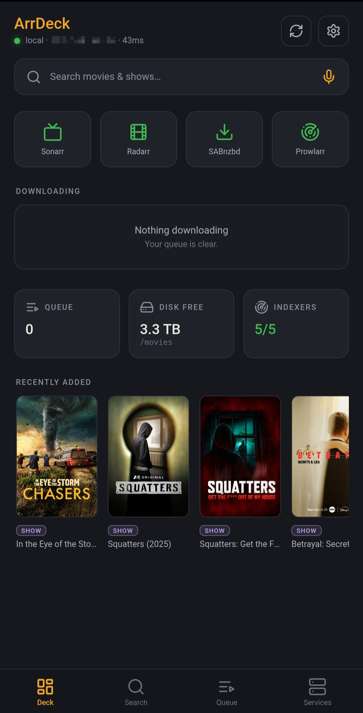
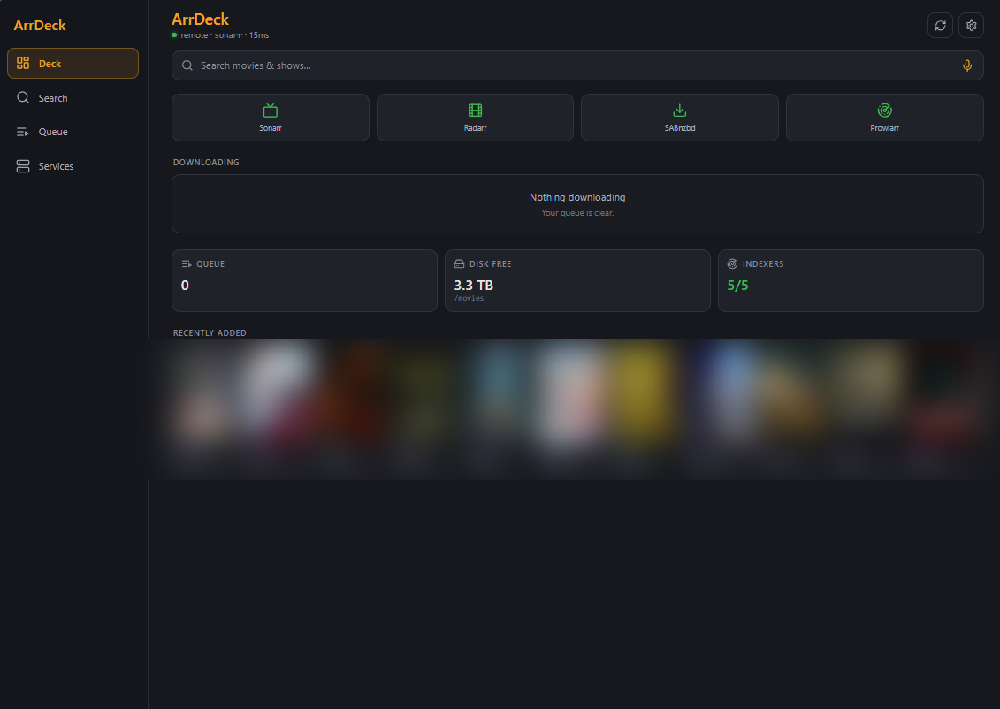
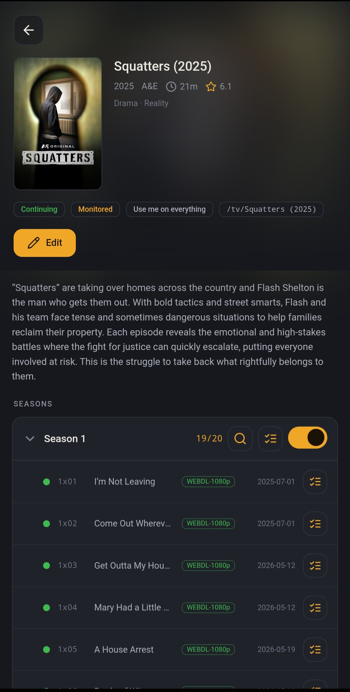

<div align="center">


# ArrDeck

**A self-hosted media-stack command center.**
Search, control, and monitor your *arr stack — Sonarr · Radarr · SABnzbd · Prowlarr — from one clean interface, at home or remote.

[](LICENSE)
[](https://github.com/OdinKara/arrdeck/releases)
[](https://github.com/OdinKara/arrdeck/pkgs/container/arrdeck)



</div>

## What it is

Every other *arr controller is half-baked: dated closed-source Android apps, request-only portals, read-only dashboards. ArrDeck is the missing piece — a **beautiful, unified app that actually controls the stack**, works the same on your couch or on cellular, and runs as either a native Android app **or** a Docker web UI in any browser.

One engine, two front doors. Pick whichever fits how you run your lab.

## Features

- **Auto-discovery onboarding** — enter your host, tap Scan; ArrDeck probes the known *arr default ports (8989/7878/8080/9696), reports what it found, you paste each API key. Custom ports supported.
- **Unified search** — one bar. Type a title; ArrDeck routes movies → Radarr and shows → Sonarr automatically. You never pick which app.
- **Command-center dashboard** — live SAB queue + speed, download progress, Prowlarr indexer health, disk free, service status at a glance.
- **Full library + native edit** — browse and edit both Sonarr (seasons/episodes, quality profile, monitoring, root folder, tags) and Radarr (movies, availability, profiles, root folder) natively. Per-episode and per-season search.
- **Interactive search** — pick the exact release to grab from a sortable, filterable list (quality · size · seeders · CF score). Rejected releases shown and still grabbable as an override.
- **Queue control** — pause / resume / delete in SABnzbd, retry failed grabs, watch imports.
- **The moat — tunnel-agnostic remote** — give each service more than one address (LAN + a Tailscale/WireGuard/Cloudflare/hostname), and ArrDeck races them ("happy-eyeballs"), using whichever answers first. Home → LAN wins. Away with your tunnel up → the remote address wins. **You never toggle anything.** ArrDeck doesn't integrate any VPN — it just uses whatever address you give it.

## Two ways to run it

### 🐳 Docker web UI

Runs next to your *arr stack like any other container; opens in any browser on any OS. The engine runs **server-side** in the container, so it reaches your services CORS-free and your API keys never touch the browser.

```yaml
# docker-compose.yml
services:
  arrdeck:
    image: ghcr.io/odinkara/arrdeck:latest
    container_name: arrdeck
    environment:
      - PORT=8090
      - ARRDECK_CONFIG_DIR=/config
    volumes:
      - ./arrdeck-config:/config      # holds services.json (your API keys, server-side only)
    ports:
      - "8090:8090"
    restart: unless-stopped
```

```bash
docker compose up -d
# open http://<your-host>:8090 and add your services in the UI,
# or pre-seed ./arrdeck-config/services.json (see Configuration).
```

On first run, add each service by its **address + port** — the same `http://IP:port` you'd type in a browser (e.g. `http://192.168.1.50:8989`). ArrDeck can also **auto-discover** services running on your host — just tap **Scan** and it probes the known *arr default ports for you.

**Optional: join your existing *arr Docker network**

If your Sonarr/Radarr/etc. already run in Docker on a shared network, you can add ArrDeck to it and address them by container name (no IPs, CORS-free). Add to the compose:

```yaml
services:
  arrdeck:
    # ...existing config above...
    networks:
      - arr-network            # <- your existing *arr network's name

networks:
  arr-network:
    external: true
```

Find your network's name with `docker network ls`. Then address services as `http://sonarr:8989`, `http://radarr:7878`, etc.



### 📱 Android app

Grab the latest signed APK from [Releases](https://github.com/OdinKara/arrdeck/releases), sideload it, and run through onboarding. The engine runs **on-device** and talks straight to your services — perfect for couch + remote use, where the tunnel-agnostic moat shines.

> Not on Google Play by design — media-stack controllers trip Play's tooling policies, and self-hosters sideload without blinking.



## Configuration

ArrDeck stores a list of services in `services.json` (the app manages this for you; the Docker UI keeps it in the `/config` volume). Each service has one or more candidate addresses and an API key. Copy [`config/config.example.json`](config/config.example.json) to `services.json` and fill it in:

```json
[
  { "kind": "sonarr",   "addresses": ["http://sonarr:8989"], "apiKey": "YOUR_SONARR_API_KEY" },
  { "kind": "radarr",   "addresses": ["http://radarr:7878"], "apiKey": "YOUR_RADARR_API_KEY" },
  { "kind": "sabnzbd",  "addresses": ["http://sabnzbd:8080"], "apiKey": "YOUR_SAB_API_KEY" },
  { "kind": "prowlarr", "addresses": ["http://prowlarr:9696"], "apiKey": "YOUR_PROWLARR_API_KEY" }
]
```

Give a service **multiple** addresses to activate the happy-eyeballs race — e.g. a LAN IP *and* a Tailscale address — and ArrDeck picks the reachable one automatically. Find each API key in that service's Settings → General.

## 🔒 Security

The web UI is a **control surface for your whole stack** — treat it like you'd treat Sonarr's own UI. Do **not** expose it raw to the internet. Put it behind your own reverse proxy with auth, or reach it over your VPN/tunnel. Keep `services.json` (it holds your keys) out of any public location.

> ArrDeck runs as root inside the container, and its `./arrdeck-config` volume is created root-owned on the host — normal for a self-contained app that only manages its own `services.json`; it works out of the box with no permission setup. To run it unprivileged instead, add `user: "1000:1000"` to the service and pre-create `./arrdeck-config` owned by that UID.

## Building from source

```bash
npm ci
npm run build            # web + engine → dist/
npx cap sync android     # sync into the Android project
cd android && ./gradlew assembleDebug   # debug-signed APK, no keystore needed
```

Release-signed builds are produced by the maintainer with a private keystore; the built APK is published to Releases. `config/`, `.env`, and all signing material are gitignored — see [`.env.example`](.env.example) and [`android/key.properties.example`](android/key.properties.example).

## Support

ArrDeck is free and AGPL, and nothing in it is paywalled — no paid tier, no key, no feature held back. If it saves you some clicks, there's a tip jar at **[donate.grimnirworks.com](https://donate.grimnirworks.com)** (Bitcoin, Lightning, X Money, GitHub Sponsors), also reachable from the heart in the app's header. Issues and PRs are just as welcome.

## License

[AGPL-3.0-or-later](LICENSE). ArrDeck stays open source — **including if you host the web UI as a service.** If you modify and serve it, you share your source. Copyright © 2026 GrimnirWorks · [GrimnirWorks](https://grimnirworks.com).
